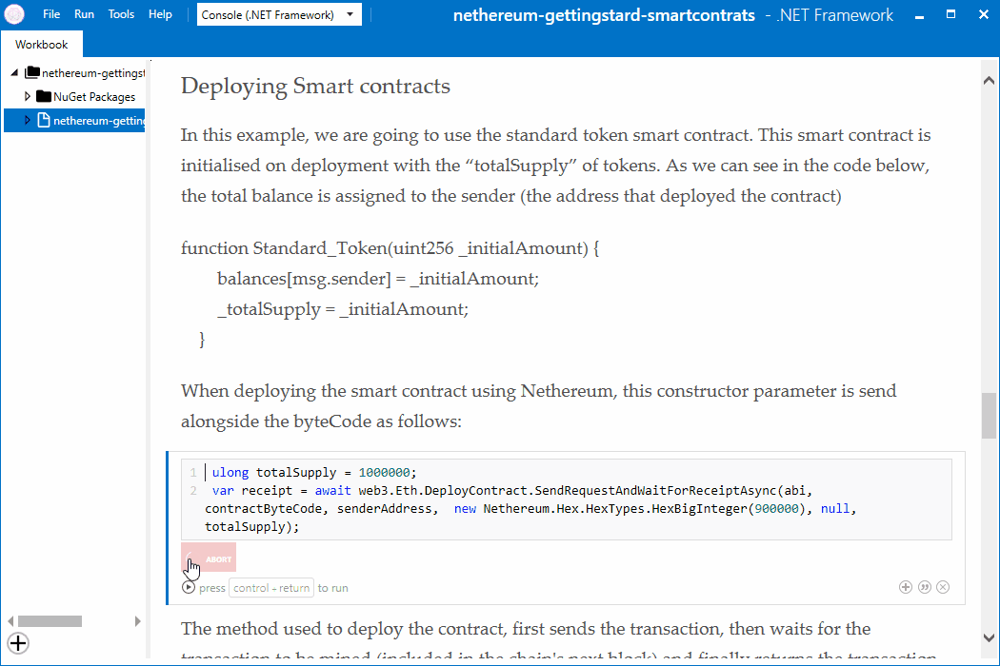

# Nethereum tutorials using Xamarin workbooks

"Xamarin Workbooks provide a blend of documentation and code that is perfect for experimentation, learning, and creating guides and teaching aids." For more info and installation requirements go to the [Xamarin Workbooks web site]( https://developer.xamarin.com/guides/cross-platform/workbooks/)

The table below provides Download links to Nethereum workbooks:

## Workbooks list

| Workbook      | Description   | File |
| ------------- |:-------------| -----:|
|[Getting Started With Smart Contracts (untyped)](nethereum-gettingstard-smartcontrats.workbook)|Learn how to create an account using a private key. Deploy a smart contract. Estimate the gas cost of a contract transaction. Send a transaction to the smart contract. Make a call to a smart contract. Retrieve the state of a smart contract from a previous block. This worbook uses untyped contract definitions|[Workbook](nethereum-gettingstard-smartcontrats.workbook)|
[Getting started with Smart Contracts (typed definitions)](nethereum-using-cqs.md)|Learn how to create an account using a private key. Deploy a smart contract. Estimate the gas cost of a contract transaction. Send a transaction to the smart contract. Make a call to a smart contract. This worbook uses typed contract definitions|[Workbook](nethereum-using-cqs.workbook)||
|[Nethereum Getting Started](nethereum-gettingstarted.workbook)|Learn a few simple interactions with a Blockchain|[Workbook](nethereum-gettingstarted.workbook)|
[Getting started Infura](nethereum-gettingstarted-infura.workbook)|Connect to Infura and retrieve the balance of an account|[Workbook](nethereum-gettingstarted-infura.workbook)|
[HD Wallet](nethereum-hdwallet-infura-transfer.workbook)|Learn to instantiate an HD wallet using the mnemonic backup seed words, retrieve the first account private key and finally transfer some Ether using Infura|[Workbook](nethereum-hdwallet-infura-transfer.workbook)|
|[Setting Up Events Polling Services](nethereum-eventdtos-getallchanges.workbook)|Learn how to log events by setting up polling services|[Workbook](nethereum-eventdtos-getallchanges.workbook)|
|[Creating A New Account Using Geth](nethereum-creating-a-new-account-using-geth.workbook)|Create a new account with Geth |[Workbook](nethereum-creating-a-new-account-using-geth.workbook)|
[Chain Id Management](nethereum-chainid-management.workbook)|Learn how to protect your code against replay attacks|[Workbook](nethereum-chainid-management.workbook)|
[Unit conversion](nethereum-converting-units.workbook)|Convert Ethereum currency units \(Eth\Gwei\Wei\) using Nethereum methods|[Workbook](nethereum-chainid-management.workbook)|
